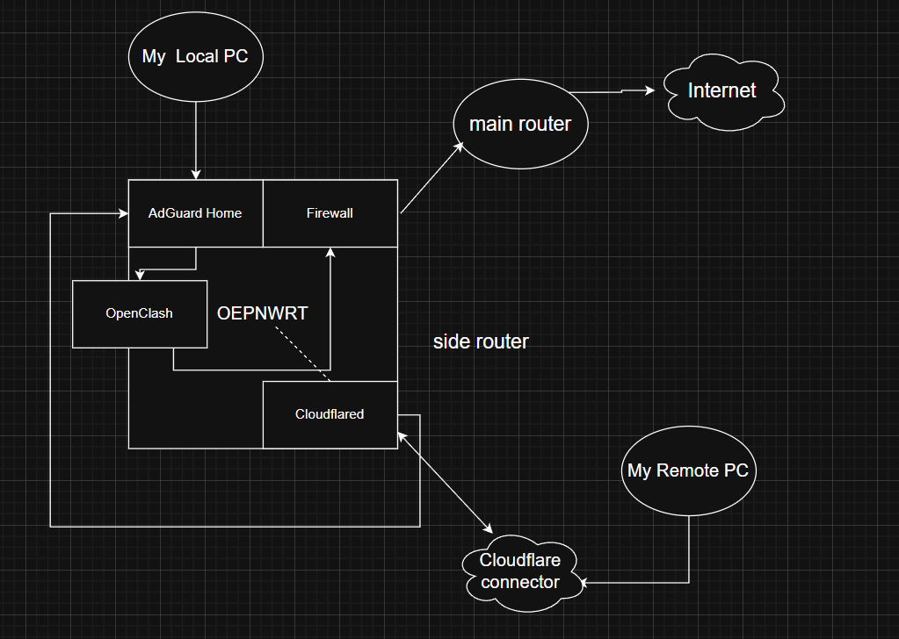
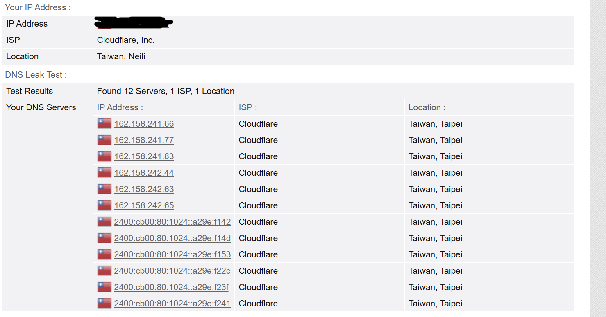
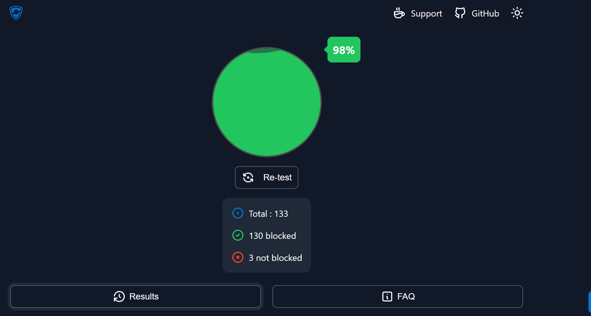

# Architecting a Resilient Home Network in China: OpenWrt, AdGuard Home, and Cloudflare Zero Trust

[](LICENSE)

## 1. The Challenge: Network Rigidity and DNS Pollution

In restrictive network environments such as China, especially if you use a company or school network, standard ISP-provided hardware often becomes a bottleneck for power users and developers. The primary pain points I encountered were:

* **DNS Pollution & Hijacking:** Unreliable domain resolution leads to connection timeouts. While tools like [BrowserLeaks](https://browserleaks.com/dns) can estimate leaks, they are often insufficient in sophisticated environments. If an ISP utilizes **DNAT (Destination NAT)** to transparently hijack UDP 53 traffic, standard leak tests may return false negatives because the interception happens silently without cryptographic verification.
* **Lack of Granularity:** Client-side ad-blocking (installing apps on every phone and laptop) is unscalable. I needed a network-level "sinkhole" to filter traffic for all devices—including IoT hardware that cannot run ad-blocking software.
* **Security Risks:** Your ISP can see the complete traffic without safe proxy. And I also need to access home resources remotely without exposing dangerous ports to the public internet.

As a Computer Science student, I needed a solution that offered low-latency secure tunneling, comprehensive ad-blocking, and secure remote management.

## 2. The Solution: A Split-Gateway Topology

To solve this, I designed a network architecture separating **Data Link/Physical layer responsibilities** from **Network/Application layer processing**.



* **Primary Router (Infrastructure):** Handles Wi-Fi broadcasting and raw PPPoE negotiation (standard consumer router duties).
* **Secondary Gateway (Intelligence):** An OpenWrt-based device acting as a "Bypass Gateway" (Side Router) to handle DNS resolution, traffic shaping, and ad-blocking.

### Hardware Prerequisites

1.  **Primary Router:** Any high-performance consumer router capable of AP mode.
2.  **Secondary Gateway:** A device (e.g., Raspberry Pi, NanoPi, or x86 Mini PC) capable of running **OpenWrt**.

## 3. Implementation

### Phase 0: Firmware Preparation (Flashing OpenWrt)

*Note: The flashing process varies significantly by hardware manufacturer. The following is a generalized workflow.*

Before configuring the network, the secondary gateway must be flashed with OpenWrt to gain root access and package management capabilities.

1.  **Select Hardware:** Consult the [OpenWrt Table of Hardware](https://openwrt.org/toh/start) to ensure your device is supported.
2.  **Unlock Bootloader:** For many consumer routers (e.g., Xiaomi, Redmi), you must first exploit the stock firmware to enable SSH and unlock the bootloader.
3.  **Flash Recovery Environment:** It is best practice to flash a custom bootloader (like **Breed** or **U-Boot**) to prevent "bricking" the device.
4.  **Install OpenWrt:**
    * Download the `squashfs-sysupgrade.bin` specific to your target architecture (x86_64, ARM, MIPS).
    * Upload the firmware via the recovery web interface or SSH.

    ```bash
    # Example SSH flash command (device specific)
    scp openwrt-firmware.bin root@192.168.1.1:/tmp/
    ssh root@192.168.1.1 "sysupgrade -v /tmp/openwrt-firmware.bin"
    ```

### Phase 1: Network Topology Configuration

I configured the primary router to handle the PPPoE connection to the ISP. Crucially, I **disabled DHCP** on the primary router to delegate address management to the OpenWrt gateway.

* **Primary Router IP:** `10.0.0.1` (Static)
* **Mode:** Wireless Access Point (AP)

Next, I configured the OpenWrt gateway:
1.  Connected via Ethernet to the Primary Router (LAN to LAN).
2.  Assigned Static IP: `10.0.0.5`.
3.  Configured as a **Bypass Gateway** (pointing its IPv4 Gateway to `10.0.0.1`).

### Phase 2: Environment Dependencies & OpenClash

Accessing the OpenWrt gateway via SSH, I updated the package lists and installed the necessary dependencies for traffic routing and kernel modules.

*Technical Note: OpenWrt utilizes `opkg` for package management.*

```bash
# Update package lists
opkg update

# Install core dependencies and networking tools
opkg install bash iptables dnsmasq-full curl ca-bundle ipset ip-full \
iptables-mod-tproxy iptables-mod-extra ruby ruby-yaml kmod-tun \
kmod-inet-diag unzip luci-compat luci luci-base

# Install OpenClash (Secure Tunneling Client)
# Assuming the IPK is transferred to /tmp via SCP
opkg install /tmp/openclash.ipk
```

### Phase 3: AdGuard Home Integration

To implement network-wide ad-blocking, I integrated AdGuard Home. This acts as a DNS sinkhole, intercepting DNS requests and blocking known tracking domains.

*(Note: Ensure you download the binary matching your CPU architecture, e.g., ARM64 vs AMD64).*

```bash
cd /tmp
# Example for ARM64 architecture
wget [https://github.com/AdguardTeam/AdGuardHome/releases/download/v0.107.43/AdGuardHome_linux_arm64.tar.gz](https://github.com/AdguardTeam/AdGuardHome/releases/download/v0.107.43/AdGuardHome_linux_arm64.tar.gz)
tar -zxvf AdGuardHome_linux_arm64.tar.gz
cd AdGuardHome
./AdGuardHome -s install
```

### Phase 4: Firewall & Port Management

I configured the OpenWrt firewall (`iptables` wrapper) to allow traffic on the management ports for both services (Port `3000` for AdGuard Home and `9090` for OpenClash).

```bash
# /etc/config/firewall configuration via UCI
uci add firewall rule
uci set firewall.@rule[-1].name='Allow-AdGuard-WebUI'
uci set firewall.@rule[-1].src='lan'
uci set firewall.@rule[-1].proto='tcp'
uci set firewall.@rule[-1].dest_port='3000'
uci set firewall.@rule[-1].target='ACCEPT'
uci commit firewall
/etc/init.d/firewall restart
```

### Phase 5: The DNS Pipeline

This is the most critical configuration to ensure no DNS leaks occur and traffic is routed correctly.

1.  **OpenClash:** Disabled built-in DNS sniffing to prevent conflicts.
2.  **AdGuard Home:**
    * **Listeners:** `::1:53` and `0.0.0.0:53`.
    * **Upstream DNS:** Points to the OpenClash local DNS port (e.g., `127.0.0.1:7874`).
    * **DHCP Server:** Enabled on AdGuard Home.
        * **Gateway set to:** `10.0.0.5` (The OpenWrt device).
        * **Subnet:** `10.0.0.0/8`.

**The Traffic Flow:**
`Client Device` -> `AdGuard Home (Filter Ads)` -> `OpenClash (Route Traffic/Tunnel)` -> `Internet`

### Phase 6: Secure Remote Access (Cloudflare Zero Trust)

To manage the home network from outside without exposing ports (and risking security breaches), I utilized **Cloudflared**.

1.  Installed `cloudflared` on OpenWrt.
2.  Created a Tunnel via the Cloudflare Zero Trust Dashboard.
3.  Mapped `10.0.0.5:80` (LuCI Interface) to a custom subdomain (e.g., `admin.mydomain.com`).
4.  **Security Policy:** Enabled Zero Trust authentication (requiring email OTP) to access the subdomain.

## 4. Impact and Results

By shifting from a standard ISP setup to this custom "Split-Gateway" architecture, I achieved:

* **Enhanced Privacy:** Encrypted DNS resolution prevents ISP snooping and mitigates DNAT hijacking.
* **Network Efficiency:** Intrusive ads are blocked at the DNS level before reaching client devices, saving bandwidth.
* **Zero-Trust Security:** Administrative access is entirely hidden behind Cloudflare's edge network, eliminating the attack surface of open ports.

### Verification

**1. DNS Leak Test**
*No DNS leaks detected; all requests are secured.*


**2. AdBlock Efficiency**
*Successfully filtering trackers and ads network-wide.*
